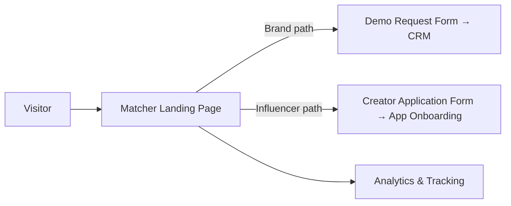
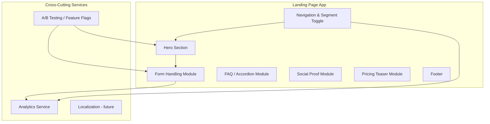
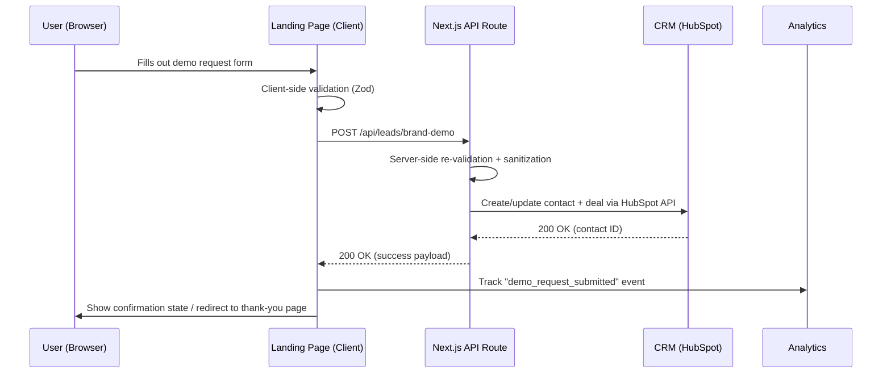

# Matcher — Landing Page Architecture

**Document Owner:** Technical Architecture
**Status:** Reference Document — Living Doc
**Last Updated:** July 22, 2026

---

## 1. Overview

The **Matcher landing page** is the primary public-facing marketing and conversion surface for Matcher, a two-sided platform connecting brands with influencers. The page serves two distinct audiences from a single codebase:

- **Brands** — evaluating Matcher for influencer discovery, campaign management, and ROI tracking. Primary conversion goal: book a demo or start a trial.
- **Influencers** — evaluating Matcher for brand partnership opportunities. Primary conversion goal: submit a creator application.

The landing page itself is a **marketing site**, not the core product application. It does not contain the matching engine, campaign dashboards, or payment workflows — those live in the authenticated Matcher web app (a separate system, out of scope for this document). The landing page's job is to inform, build trust, capture leads, and hand off qualified visitors to either:
1. A sales/demo funnel (brands), or
2. A creator sign-up/onboarding funnel (influencers), which may live in the main app.



---

## 2. Tech Stack

| Layer | Choice | Notes |
|---|---|---|
| Language | TypeScript | Strict mode enabled across the codebase |
| Framework | Next.js 14 (App Router) | Server-rendered marketing pages, static generation for content-heavy routes |
| UI Library | React 18 | Function components + hooks only |
| Styling | Tailwind CSS | Design tokens shared with the main product app for visual consistency |
| Component Primitives | Radix UI | Accessible primitives for toggles (Brand/Influencer switch), modals, accordions (FAQ) |
| Forms | React Hook Form + Zod | Client-side validation with schema reuse on the server |
| Content Management | MDX + local content files (Phase 1) → headless CMS (Contentful) planned Phase 2 | Blog/case study content authored without redeploys |
| Hosting | Vercel | Edge network deployment, native Next.js support, preview deployments per PR |
| Database | None directly | Landing page is stateless; form submissions are relayed to CRM/API, not stored locally |
| Backend/API | Next.js API Routes (serverless functions) | Thin proxy layer for form submission, no business logic |
| Image Optimization | Next/Image + Vercel Image Optimization | Automatic WebP/AVIF conversion, responsive sizing |
| Package Manager | pnpm | Faster installs, monorepo-friendly if landing page later merges into a shared repo |

---

## 3. System Components



### Core Modules

- **Segment Router / Toggle** — Client-side state (persisted via URL query param, e.g. `?for=brands` or `?for=influencers`) that swaps hero copy, CTA labels, and feature ordering. No hard page split; one route (`/`) with conditional rendering to simplify SEO and maintenance.
- **Form Handling Module** — Two forms: "Book a Demo" (brands) and "Apply as a Creator" (influencers). Validated client-side with Zod schemas, submitted to internal API routes, which forward to the CRM and/or app onboarding service.
- **Social Proof Module** — Renders testimonials, logos, and animated stat counters. Content sourced from local JSON/MDX in Phase 1; CMS-driven in Phase 2.
- **FAQ Module** — Accordion component with segmented content sets (brand FAQs vs. influencer FAQs), driven by static content.
- **Pricing Teaser Module** — Static pricing cards; links out to a dedicated `/pricing` route rather than embedding full pricing logic.
- **Analytics Service Wrapper** — A thin internal abstraction (`lib/analytics.ts`) around GA4 and the product analytics tool, so tracking calls aren't scattered ad hoc through components.
- **A/B Testing / Feature Flags** — Lightweight flag evaluation (e.g., via Vercel Edge Config or a flagging service) to test hero copy, CTA wording, and layout variants without redeploys.

---

## 4. Data Flow

The landing page is largely stateless and read-heavy. The only meaningful data flow is form submission.

### 4.1 General Page Load Flow

```
Visitor Request
      │
      ▼
Vercel Edge Network (CDN cache check)
      │
      ├── Cache HIT  → Serve static/ISR page immediately
      │
      └── Cache MISS → Next.js server render / regenerate
                              │
                              ▼
                     Static content (MDX/JSON) + build-time data
                              │
                              ▼
                     HTML + hydrated React sent to client
                              │
                              ▼
                     Client-side analytics init, A/B flag fetch
```

### 4.2 Form Submission Flow (e.g., "Book a Demo")



### 4.3 Influencer Application Flow

Similar shape, but the API route forwards to the **main Matcher app's onboarding service** (internal REST API) rather than a CRM, since influencer applications feed directly into the product's creator vetting pipeline.

```
Form Submit → /api/leads/creator-application → Matcher App API (POST /v1/creators/applications) → Confirmation
```

No PII is persisted in the landing page's own infrastructure at rest — it is a pass-through layer.

---

## 5. Authentication & Security

The landing page itself is **public and unauthenticated** — there is no login on this surface. Security focus is on data-in-transit, input handling, and abuse prevention rather than session management.

- **Transport Security:** HTTPS enforced everywhere (HSTS enabled); Vercel handles TLS termination and certificate rotation.
- **Input Validation:** All form inputs validated both client-side (Zod) and server-side (duplicate schema on the API route) to prevent malformed or malicious payloads reaching downstream systems.
- **Bot & Spam Protection:** Cloudflare Turnstile (or equivalent CAPTCHA-alternative) on both lead forms to prevent automated spam submissions.
- **Rate Limiting:** API routes rate-limited per IP (e.g., via Vercel middleware or Upstash Redis token bucket) to prevent abuse of the form-submission endpoints.
- **CSRF Protection:** Same-site cookie policy and origin header checks on API routes, since forms are same-origin only.
- **Secrets Management:** All third-party API keys (CRM, analytics, flagging service) stored as encrypted environment variables in Vercel, never exposed to the client bundle. Client-safe keys (e.g., GA4 measurement ID) are explicitly prefixed (`NEXT_PUBLIC_*`) and reviewed before use.
- **Content Security Policy (CSP):** Strict CSP headers limiting script/style sources to known first-party and approved third-party domains (analytics, CRM embed if used, image CDN).
- **Dependency Hygiene:** Automated dependency vulnerability scanning (e.g., GitHub Dependabot) on every PR.
- **PII Handling:** Form data (name, email, company, social handles) is transmitted directly to CRM/app APIs and not logged in plaintext in application logs. Only anonymized event metadata is retained for analytics.

---

## 6. Performance & Scalability

The landing page is read-heavy and highly cacheable, which keeps scaling requirements modest.

- **Rendering Strategy:** Static Site Generation (SSG) for the homepage and content pages, with Incremental Static Regeneration (ISR) for sections that update periodically (testimonials, stats, pricing) — revalidated on a time interval (e.g., every 60 minutes) rather than on every request.
- **CDN:** Vercel's global edge network serves cached HTML/assets close to the visitor; no origin round-trip needed for cache hits.
- **Image Optimization:** All images served via Next/Image with automatic format negotiation (AVIF/WebP), responsive `srcset`, and lazy loading below the fold.
- **Code Splitting:** Route- and component-level code splitting via Next.js; heavy components (e.g., video embeds, animated counters) are dynamically imported and loaded only when scrolled into view.
- **Font Loading:** Self-hosted, subsetted fonts loaded via `next/font` to avoid layout shift and third-party font-CDN latency.
- **Performance Budgets/Targets:**
  - Largest Contentful Paint (LCP): < 2.5s (mobile, 4G)
  - Cumulative Layout Shift (CLS): < 0.1
  - Total JS payload (initial route): < 200KB gzipped
- **Scalability:** Because the page is served almost entirely from cache/edge, traffic spikes (e.g., a launch announcement or press mention) are absorbed by the CDN without additional infrastructure provisioning. The only components that scale with traffic are the serverless API routes (form submission) and the downstream CRM/app APIs, both of which are protected by rate limiting.

---

## 7. Deployment & Infrastructure

### Environments

| Environment | Purpose | URL pattern |
|---|---|---|
| Local | Developer machines | `localhost:3000` |
| Preview | Auto-deployed per pull request | `matcher-landing-<pr-id>.vercel.app` |
| Staging | Pre-production QA, connected to sandbox CRM/API | `staging.matcher.com` |
| Production | Live site | `matcher.com` |

### CI/CD Pipeline

```mermaid
flowchart LR
    Dev[Developer Push] --> PR[Pull Request]
    PR --> Lint[Lint + Type Check]
    Lint --> Test[Unit Tests - Vitest]
    Test --> Build[Next.js Build]
    Build --> Preview[Vercel Preview Deploy]
    Preview --> Review[Design/PM Review]
    Review --> Merge[Merge to main]
    Merge --> StagingDeploy[Auto-Deploy to Staging]
    StagingDeploy --> QA[Manual QA + Lighthouse CI]
    QA --> ProdDeploy[Promote to Production]
```



- **CI Tooling:** GitHub Actions runs lint (ESLint), type-check (`tsc --noEmit`), and unit tests on every PR.
- **Automated Checks:** Lighthouse CI runs against staging on every merge to `main`, gating deploys on performance/accessibility score thresholds.
- **Deployment:** Vercel Git integration — every push to `main` deploys to staging automatically; production deploys are a manual promotion step (or automatic after QA sign-off, depending on release cadence).
- **Rollback:** Vercel's instant rollback to any previous deployment (atomic deploys, no build-time downtime).
- **Environment Variables:** Managed per-environment in Vercel's dashboard; synced to `.env.example` in the repo (without real values) for onboarding clarity.

---

## 8. API Endpoints

The landing page exposes a minimal set of its own serverless API routes. It does **not** expose the core Matcher product API — those endpoints belong to the main application and are only referenced here as downstream calls.

### Landing Page's Own Endpoints (Next.js API Routes)

| Method | Endpoint | Purpose | Downstream Call |
|---|---|---|---|
| `POST` | `/api/leads/brand-demo` | Submit brand demo request | HubSpot Contacts/Deals API |
| `POST` | `/api/leads/creator-application` | Submit influencer application | Matcher App API (`/v1/creators/applications`) |
| `POST` | `/api/newsletter/subscribe` | Footer newsletter signup | Email service API (e.g., Mailchimp/Customer.io) |
| `GET` | `/api/flags` | Fetch active A/B test / feature flag config | Feature flag service (Edge Config) |
| `GET` | `/api/health` | Health check for uptime monitoring | — |

### Example Request/Response — Brand Demo Submission

```http
POST /api/leads/brand-demo
Content-Type: application/json

{
  "fullName": "Jane Doe",
  "workEmail": "jane@brandco.com",
  "companyName": "BrandCo",
  "companySize": "51-200",
  "message": "Interested in a demo for our Q3 campaign."
}
```

```json
// 200 OK
{
  "success": true,
  "leadId": "hs_1234567",
  "message": "Thanks! Our team will reach out within 1 business day."
}
```

```json
// 422 Validation Error
{
  "success": false,
  "errors": {
    "workEmail": "Please use a valid work email address."
  }
}
```

---

## 9. Third-Party Integrations

| Service | Purpose | Integration Point |
|---|---|---|
| **HubSpot** | CRM for brand leads; deal pipeline for sales follow-up | Server-side API call from `/api/leads/brand-demo` |
| **Matcher App API** | Receives influencer applications, feeds creator vetting pipeline | Server-side API call from `/api/leads/creator-application` |
| **Google Analytics 4** | Pageview, event, and funnel tracking | Client-side script, loaded via `lib/analytics.ts` wrapper |
| **Amplitude** (or Mixpanel) | Product/funnel analytics, segment-level behavior | Client-side event tracking, mirrors key GA4 events |
| **Vercel Edge Config / LaunchDarkly** | A/B testing and feature flagging | Fetched at edge/build time, evaluated client + server |
| **Cloudflare Turnstile** | Bot/spam protection on forms | Embedded widget on demo + application forms |
| **Mailchimp / Customer.io** | Newsletter and nurture email sequences | Server-side API call from `/api/newsletter/subscribe` |
| **Sentry** | Error tracking and performance monitoring | Instrumented via Sentry Next.js SDK |
| **Hotjar** (optional) | Session recording / heatmaps for UX research | Client-side script, loaded conditionally (non-EU traffic or with consent) |

All third-party scripts are loaded via `next/script` with appropriate `strategy` settings (`afterInteractive` or `lazyOnload`) to avoid blocking initial render.

---

## 10. Monitoring & Logging

- **Uptime Monitoring:** External uptime check (e.g., Better Uptime or Vercel's built-in monitoring) pings `/api/health` and the homepage every 60s; alerts sent to Slack/PagerDuty on downtime.
- **Error Tracking:** Sentry captures unhandled client-side exceptions and server-side (API route) errors, tagged by environment (staging/production) and release version (Git SHA).
- **Performance Monitoring:** Vercel Analytics + Lighthouse CI track Core Web Vitals (LCP, CLS, INP) over time; regressions beyond threshold fail the CI gate on merge.
- **Structured Logging:** API routes emit structured JSON logs (request ID, route, status, latency) to Vercel's log drain, forwarded to a log aggregator (e.g., Datadog or Logtail) for searchability.
- **Alerting Thresholds:**
  - Form submission error rate > 5% over 15 minutes → Slack alert to engineering channel
  - API route p95 latency > 1s → Slack alert
  - Lighthouse performance score drop > 10 points on a release → blocks deploy, notifies team
- **Funnel/Conversion Dashboards:** GA4 + Amplitude dashboards tracking segment selection, CTA clicks, form starts vs. completions — reviewed weekly by product/marketing, not just engineering.

---

## Appendix: Directory Structure (Reference)

```
matcher-landing/
├── app/
│   ├── page.tsx                 # Homepage (segment-aware)
│   ├── pricing/page.tsx
│   ├── api/
│   │   ├── leads/
│   │   │   ├── brand-demo/route.ts
│   │   │   └── creator-application/route.ts
│   │   ├── newsletter/subscribe/route.ts
│   │   ├── flags/route.ts
│   │   └── health/route.ts
├── components/
│   ├── hero/
│   ├── forms/
│   ├── testimonials/
│   ├── faq/
│   └── pricing/
├── lib/
│   ├── analytics.ts
│   ├── validation/               # Zod schemas (shared client/server)
│   └── flags.ts
├── content/                      # MDX/JSON content (testimonials, FAQ, stats)
├── public/
├── tests/
└── .env.example
```

---

*End of document.*
